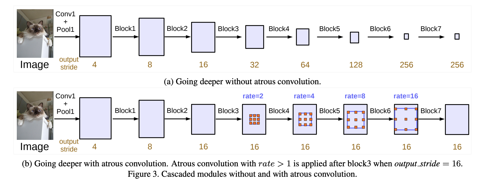

# DeepLabv3 Background 🖼️ Segmentation on webcam input
This repository contains the code for the implementation of the DeepLabv3 architecture, for the transformation of webcam background images.

To install the necessary requirements : 
```
pip install -r requirements.txt
```
There are two files which can be ran as a demo :

1. BlurBackground.py, which takes in as input the webcam feed, and outputs it with a blurred background after applying a detection of the instance segmentation mask.

```
python BlurBackground.py
```


2. ImageBackground.py, which takes in as input the webcam feed, and outputs it with a custom image background after applying a detection of the instance segmentation mask.

```
python ImageBackground.py
```


## Neural Network
The model that is being used in this app is the pre-trained [DeepLabv3 model based on the ResNet100 architecture.](https://pytorch.org/hub/pytorch_vision_deeplabv3_resnet101/)

It has been trained on the [PASCAL VOC Segmentation dataset](http://host.robots.ox.ac.uk/pascal/VOC/voc2012/).


#### References
https://github.com/ElisonSherton/instanceSegmentation
https://pytorch.org/hub/pytorch_vision_deeplabv3_resnet101/
https://debuggercafe.com/semantic-segmentation-using-pytorch-deeplabv3-resnet50/